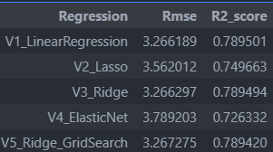
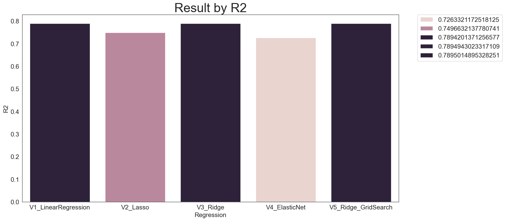
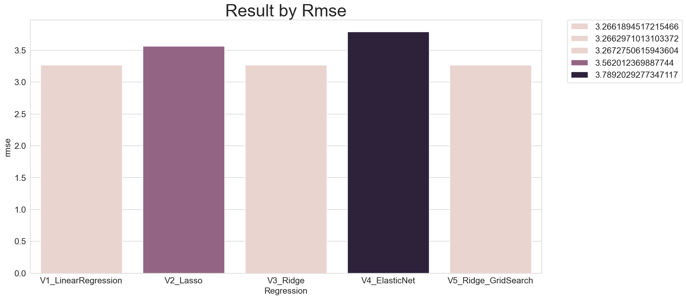
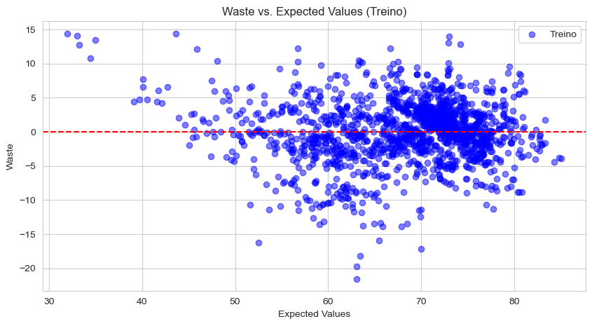
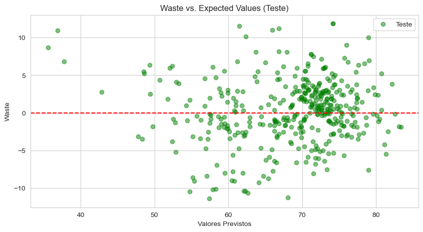

# Life_expectancy

Case Predictive Model for Life expectancy and leading causes of death and disability with Machine Learning.

##### Objective: prediction of Life expectancy.
##### Dataset: socioindicators
Font:  (https://www.who.int/data/gho/data/themes/mortality-and-global-health-estimates/ghe-life-expectancy-and-healthy-life-expectancy).

##### Pre-processing:
- StandScaler

##### Find Most relevant variables:
- Random Foresting
##### Models Prediction:
- Linear Regression
- Lasso (L1)
- Ridge (L2)
- Elastic Net Regression 

##### Parameter Optimization:
- GridSearch

##### Metrics:
- RMSE
- R2
  

##### Results:

Obs: 
R2 > Best
RMSE < Best

#### Validation:

